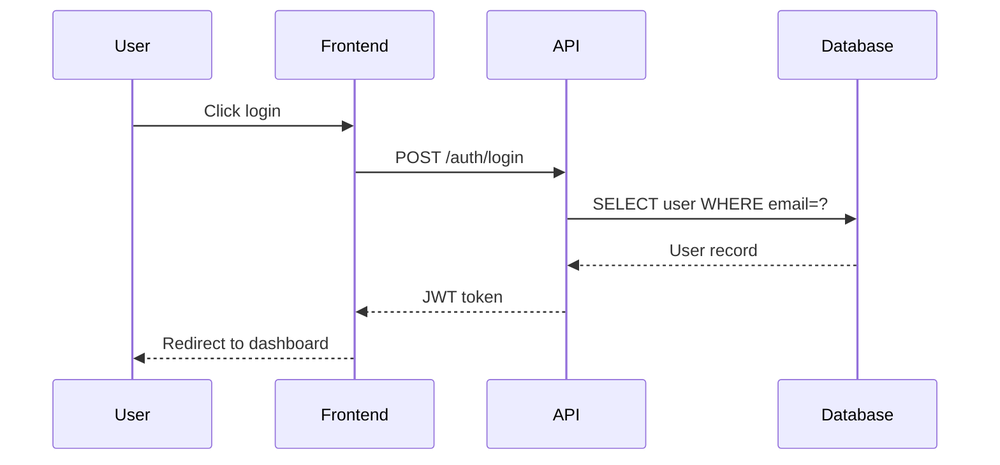

# /sequence-diagram

Generate Mermaid sequence diagrams from code analysis, natural language descriptions, or recent diffs.

## Context

- Git status: !`git status --porcelain`
- Recent diff: !`git diff HEAD~1 --stat 2>/dev/null || echo ""`

## Procedure

### 1. Determine Mode

Based on argument:

- **File path** (e.g., `src/auth.ts`) → Code Analysis mode
- **Quoted text** (e.g., `"user login flow"`) → Natural Language mode
- **No argument** → Diff Analysis mode

### 2a. Code Analysis Mode

1. Read the target file
2. Trace function calls, API interactions, and data flow
3. Identify participants (modules, services, databases, external APIs)
4. Map the interaction sequence
5. Generate Mermaid `sequenceDiagram`

### 2b. Natural Language Mode

1. Parse the description
2. Explore the codebase to find relevant code that implements the described flow
3. Identify participants and interactions
4. Generate Mermaid `sequenceDiagram`

### 2c. Diff Analysis Mode

1. Read `git diff HEAD~1` to identify changed files
2. Analyze changed interaction flows
3. Generate a diagram showing the modified sequence

### 3. Generate Diagram

Produce a valid Mermaid `sequenceDiagram`:

````markdown

````

### 4. Output

- Display the diagram in a fenced code block
- If `--output <file>` is provided, write to the specified file

### 5. Report

```
✓ Sequence diagram generated
  Participants: 4
  Interactions: 6
  Output: <file> (if --output)
```

## Notes

- Output is always valid Mermaid `sequenceDiagram` syntax
- Participants are derived from actual code modules/services when possible
- In diff mode, only changed interactions are included
- Diagrams focus on the main flow — error paths are included only if significant
